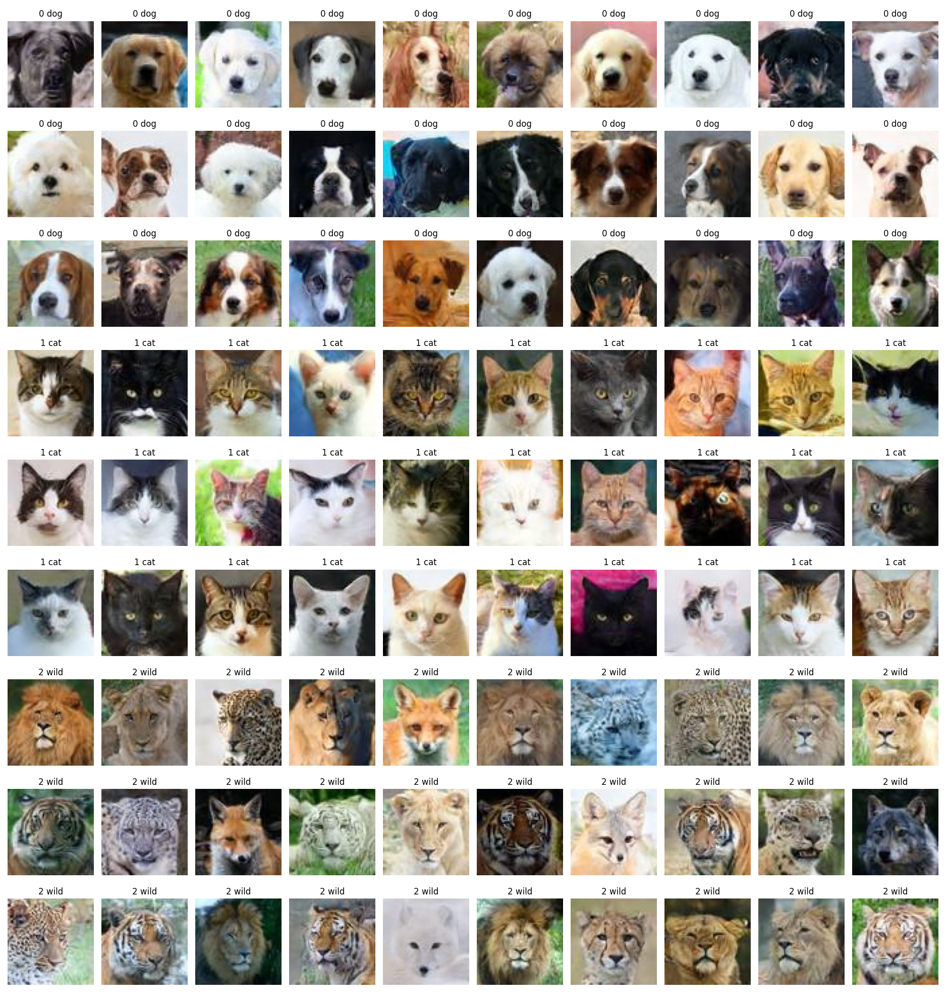

# Conditional Denoising Diffusion Probabilistic Model (DDPM) for Synthetic Image Generation

This repository contains code for constructing and training a conditional diffusion model on CIFAR10, CelebA,
and HFHQ. Below is a brief summary of the repo layout:

- `config`: This folder contains config files that specify model architecture and training hyperparameters.
- `utils.py`: This module contains general utility functions used throughout training and analysis.
- `dataset_utils.py`: This module contains utility functions for pre-processing and constructing dataloaders.
- `gaussian_diffusion`: This module contains methods for training and sampling Gaussian diffusion models.
- `ddpm_trainer`: This module defines the training routine for a diffusion model and provides a Trainer class
  which performs all training operations and checkpointing.
- `unet.py`: This module contains the model definition of the U-Net diffusion models.
- `runner.py`: This module provides easy-to-use function for running training for a given config.
- `gen_video.py`: This module can be used to create time lapse videos of samples throughout training.
- `environment.yml` - This file outlines the requirements of the conda env used to run the experiments of this
  project.

## Abstract

This project presents the implementation and training of a Denoising Diffusion Probabilistic Model (DDPM) for
high-quality image generation, with Denoising Diffusion Implicit Models (DDIM) used to provide a more
efficient sampling procedure. The model is trained on a large collection of RGB images, learning to
progressively remove noise that is added to images through a predefined forward diffusion process. Unlike
conventional GAN-based approaches that came before, diffusion models are trained through a stable denoising
objective in which the neural network learns to predict the noise introduced at different levels of
corruption. During generation, the learned denoising process is reversed to transform randomly sampled
Gaussian noise into realistic images. DDIM extends the standard DDPM sampling procedure by allowing fewer,
deterministic sampling steps, substantially reducing generation time while maintaining image quality. The
resulting model can be used for applications including realistic image synthesis, image reconstruction and
denoising, latent-space or image-space interpolation, and image in-painting.

The grid of synthetic images (64 x 64 x 3)  below are from the diffusion model trained on the AFHQ dataset:
